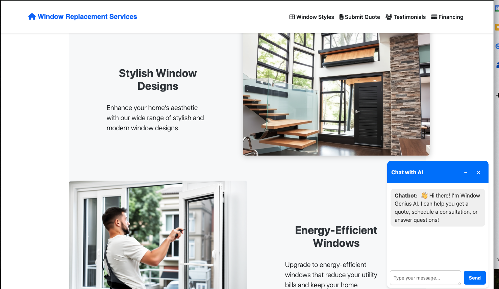
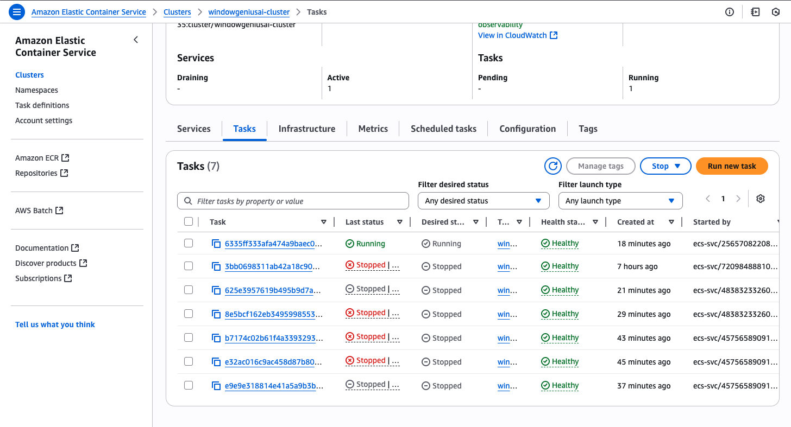
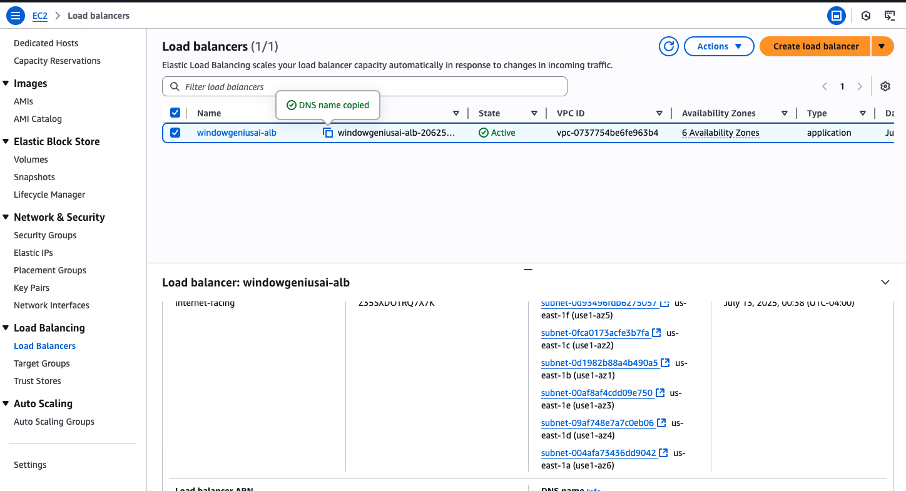
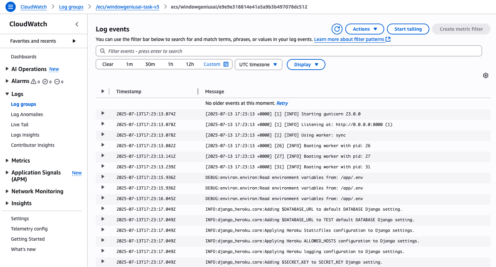

# Window Genius AI – Smart Window Lead Generation Platform





**Window Genius AI** is a full-stack Django CRM and lead generation system designed for window installation businesses in the U.S. Built and deployed by a **Software Engineer** and **Cloud DevOps Engineer**, it combines modern web development with production-ready AWS infrastructure.

---

## 🚀 Features

- ✨ High-converting landing page (Bootstrap 5)
- 💬 AI chatbot (OpenAI) that captures leads interactively
- 📩 Smart quote request form with real-time email notifications
- 📊 Custom AdminLTE dashboard:
  - Lead tracking and message inbox
  - Quote lifecycle management (New → Pending → Active → Completed)
  - Order tracking and revenue metrics
- 🔗 Facebook Lead Ads integration via Webhooks  
  (Permissions: `leads_retrieval`, `pages_read_engagement`, `pages_show_list`)
- 🧠 SaaS onboarding with pricing plans (Starter, Pro, Agency)
  - Stripe integration, Calendly scheduling, Google Forms intake
- 🔐 User authentication with role-based access
- ☁️ **Deployed to AWS using ECS Fargate with Docker containers**
- 🧱 Container image stored and pulled from Amazon ECR
- 🔐 Secrets managed securely via AWS Secrets Manager and S3 environment files
- 📈 Logging and monitoring integrated with AWS CloudWatch
- 🔄 CI/CD with GitHub Actions for automated deployment
- 🧠 **Built using real-world Cloud DevOps best practices**

---

## 🧠 Tech Stack

- **Frontend:** HTML, CSS, JavaScript, Bootstrap 5
- **Backend:** Django, SQLite (dev), PostgreSQL (prod)
- **Chatbot:** OpenAI GPT-3.5
- **CI/CD:** GitHub Actions
- **Cloud:** AWS (ECS Fargate, ECR, S3, Secrets Manager, CloudWatch, ALB)
- **Containerization:** Docker
- **Email:** SMTP via Django
- **Security:** CSP, HTTPS, SEO, GA4, role-based access

---

## 📸 Screenshots

### ECS Tasks (Fargate)

> Deployment live on AWS ECS Fargate 🚀  
> Includes real-time scaling, health checks, and task logging.  
> Live tasks running on Amazon ECS with health checks and rolling deployments



### AWS Load Balancer (ALB)

> Application Load Balancer routing traffic with high availability zones



### ECS CloudWatch Logs

> Django boot logs captured in AWS CloudWatch for ECS container observability




---

## ⚙️ Run Locally with Docker

```bash
git clone https://github.com/Tunde-cs/window-landing-page.git
cd window-landing-page
docker build -t windowgeniusai .
docker run -p 8000:8000 windowgeniusai
